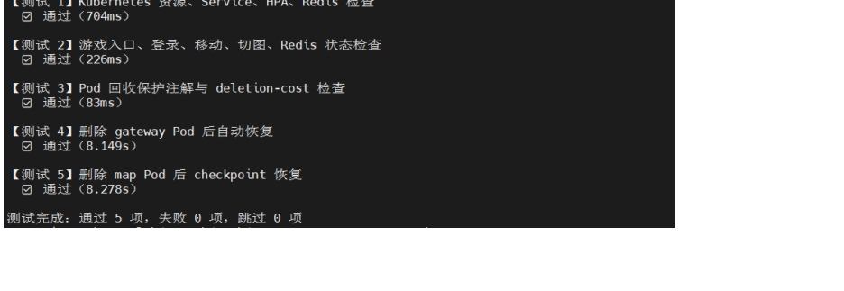

# Lab 4: Self-Managed Kubernetes Deployment for a Distributed Game

## Implementation Summary

In my Lab4 implementation, the distributed game backend was deployed with one
gateway, one coordinator, three independent map services, and Redis-backed
shared state. The Kubernetes deployment used HPA for the five business
services, while Redis was kept as a StatefulSet without HPA to avoid state
inconsistency.

The **98/100** score was supported by several concrete deployment choices. HPA
was configured for the gateway, coordinator, and all three map services with
CPU requests set for each workload, allowing the scorer to observe scale-out
under pressure while avoiding unnecessary scaling when the system was idle.
Readiness and liveness probes were added to each business service, and preStop
hooks called the service drain endpoint before Pod termination so that traffic
could be removed from a Pod before it exited. Redis was used to persist user
sessions, shared game state, map checkpoints, and leader information, allowing
the system to recover after Pod deletion or checkpoint-restoration tests.
RBAC permissions allowed business Pods to update lifecycle annotations such as
pod-deletion-cost and draining state, which helped Kubernetes prefer less
disruptive Pods during scale-down or recycling.

## Validation Results

The automated test covers Kubernetes resources, Services, HPA, Redis, the game entry point, state checks, recovery after Pod deletion, and checkpoint recovery.



The score test result is **98/100**.


This lab requires deploying a distributed text-based game to a self-managed Kubernetes cluster. The deployment should support autoscaling, basic fault recovery, state consistency, and reasonable resource utilisation.

---

**Important scoring principle**

**This lab does not reward simply allocating excessive resources. Correct functionality and stable service are the baseline; under that condition, lower resource cost leads to a higher score.**

---

The lab provides the game source code and test scripts. You need to complete the Dockerfiles, Kubernetes YAML files, image build, image distribution, deployment verification, and performance tuning.

To avoid ambiguity, this document uses the following terms:

| Term | Meaning |
| --- | --- |
| Local machine | Your own computer, such as a Windows, macOS, or Linux laptop |
| Master node | The Kubernetes control-plane node, usually accessible from your local machine through SSH |
| Worker node | A Kubernetes worker node, usually with only a private IP address; most Pods run on these nodes |
| Cluster nodes | A collective term for the master node and worker nodes |

## 1. Lab Objective

The final deployment in your Kubernetes cluster should contain the following services:

```text
Namespace: lab4
External entry point: <reachable-node-address>:30910

Business components:
lab4-gateway
lab4-coordinator
lab4-map-green
lab4-map-cave
lab4-map-ruins

State component:
lab4-redis

Autoscaling:
All five business Deployments must be configured with HPA.
HPA minReplicas = 1
HPA maxReplicas = 10
Redis should not be configured with HPA.
```

After deployment, the client should be able to connect to the game through:

```text
<node-address>:30910
```

Example:

```text
203.0.113.10:30910
```

## 2. Prerequisite Materials

If you have not yet rented servers, installed Docker, or configured a Kubernetes cluster, prepare the base environment first. The original course slides and cloud-cluster setup notes are not included in this public repository.

These materials cover the base environment. This README focuses on what needs to be completed for Lab4 itself.

## 3. Optional: Configure Local kubeconfig

`kubeconfig` is the configuration file used by `kubectl` to connect to a Kubernetes cluster. It records the API Server address, certificates, and access credentials.

Configuring kubeconfig on your local machine allows you to run commands such as `kubectl get pods`, `kubectl apply -f ...`, and `watch ...` directly from your own computer, without logging in to the master node every time.

This step is optional. Even if local kubeconfig is not configured, the basic tests and score scripts can still run. When necessary, the test scripts will fall back to remote-login mode and ask for the master node address, username, and SSH port.

If you want to control the cluster directly from your local machine, follow the steps below.

1. Install `kubectl` locally.

2. Copy kubeconfig from the master node.

Linux/macOS:

```bash
mkdir -p ~/.kube
scp <server-username>@<master-node-address>:/etc/kubernetes/admin.conf ~/.kube/config
chmod 600 ~/.kube/config
```

Windows PowerShell:

```powershell
mkdir $HOME\.kube
scp <server-username>@<master-node-address>:/etc/kubernetes/admin.conf $HOME\.kube\config
```

3. Open kubeconfig and find the `server:` line.

It may look like this:

```text
server: https://10.0.1.10:6443
```

If your local machine cannot access this private IP address, replace it with the master node address:

```text
server: https://<master-node-address>:6443
```

4. Confirm that the cloud security rules allow your local machine to access port `6443`.

It is recommended to allow access only from your own machine, rather than exposing the port broadly.

5. Test locally:

```bash
kubectl get nodes -o wide
kubectl get pods -A
```

If you encounter certificate errors, network issues, or cloud security-rule problems, do not spend too much time on this step. You may log in to the master node and run `kubectl` there, or let the test scripts use remote-login mode. Local kubeconfig is for convenience only and is not required to complete the lab.

## 4. Pre-Deployment Checks

Before deploying Lab4, verify that the Kubernetes cluster itself is working.

If local kubeconfig has been configured, run the following commands locally. Otherwise, log in to the master node and run them there.

```bash
kubectl get nodes -o wide
kubectl get pods -A
```

All nodes should be `Ready`.

HPA depends on metrics-server. Continue checking:

```bash
kubectl top nodes
kubectl top pods -A
```

If `kubectl top` reports an error, metrics-server is not installed or not functioning correctly, and HPA-related scoring will be affected. Install or repair metrics-server before running the score test.

## 5. Step-by-Step Lab Procedure

The following steps follow the actual order in which the lab should be completed. It is recommended to proceed step by step rather than writing all YAML files at once.

### Step 1: Copy the Lab4 Code to the Master Node

Where to do this: local machine.

Why: this lab recommends building images on the cloud server rather than on the local machine. This avoids inconsistencies in CPU architecture, network access, Docker environment, and server runtime.

If the master node is reachable from your local machine, copy the directory directly:

```bash
scp -r Lab4 <server-username>@<master-node-address>:~/Lab4
```

Then log in to the master node:

```bash
ssh <server-username>@<master-node-address>
cd ~/Lab4
```

If Lab4 has already been downloaded or extracted on the master node, simply enter the directory:

```bash
cd ~/Lab4
```

Verify the directory:

```bash
ls
```

You should see:

```text
cmd
cloud
cluster
storage
test
go.mod
README.md
```

### Step 2: Understand Which Programs Need to Start

Where to do this: master node.

Why: before writing Dockerfiles and YAML, you need to know which Go program each container should start.

There are three types of business programs in this lab:

```text
gateway       -> ./cmd/cloud-gateway
coordinator  -> ./cmd/cloud-coordinator
map           -> ./cmd/cloud-map
```

The map program is deployed as three map services:

```text
lab4-map-green
lab4-map-cave
lab4-map-ruins
```

They can share the same map image and be distinguished through environment variables.

The approximate request path is:

```text
client
  -> <node-address>:30910
  -> lab4-gateway Service
  -> gateway Pod
  -> lab4-coordinator Service
  -> coordinator Pod
  -> lab4-map-green / lab4-map-cave / lab4-map-ruins Service
  -> map Pod
  -> Redis
```

Component responsibilities:

| Component | Role |
| --- | --- |
| gateway | Exposes the external TCP game entry point, maintains client connections, and forwards player actions to the coordinator |
| coordinator | Handles login, player sessions, map routing, cross-map actions, trading, and other global logic |
| map-green | Map service for the green map, handling movement, pickup, and interaction within that map |
| map-cave | Map service for the cave map |
| map-ruins | Map service for the ruins map |
| Redis | Stores user data, session data, map checkpoints, leader leases, and related state |

### Step 3: Write Dockerfiles

Where to do this: `~/Lab4` on the master node.

Why: Kubernetes runs containers rather than Go source code directly. You need to package gateway, coordinator, and map as images.

It is recommended to write at least three Dockerfiles:

```text
Dockerfile.gateway
Dockerfile.coordinator
Dockerfile.map
```

A multi-stage build is recommended:

```text
Stage 1: use a golang image to compile the Go binary.
Stage 2: use alpine, distroless, or scratch to package the compiled binary.
```

Direct access to Docker Hub may be unstable in mainland China. It is recommended to use the following Go image mirror in the build stage:

```text
m.daocloud.io/docker.io/library/golang:1.21-alpine
```

For example:

```dockerfile
ARG GO_BUILDER_IMAGE=m.daocloud.io/docker.io/library/golang:1.21-alpine
FROM ${GO_BUILDER_IMAGE} AS builder
```

Ensure that each container starts the correct entry:

```text
gateway       -> ./cmd/cloud-gateway
coordinator  -> ./cmd/cloud-coordinator
map           -> ./cmd/cloud-map
```

If Go is installed on the master node, you may check the source code first:

```bash
go test ./...
```

If Go is not installed, it is still acceptable as long as the Dockerfile compiles the code in the build stage using the Go image.

### Step 4: Build Images on the Master Node

Where to do this: `~/Lab4` on the master node.

Why: this converts the source code into images that Kubernetes can run. This lab recommends building images on the server and does not require local image builds.

Example commands:

```bash
docker build -t lab4-gateway:v1 -f Dockerfile.gateway .
docker build -t lab4-coordinator:v1 -f Dockerfile.coordinator .
docker build -t lab4-map:v1 -f Dockerfile.map .
```

Redis can use `redis:7-alpine`. If network access is unstable, pull it through the DaoCloud mirror and tag it back to the standard image name, so that subsequent `docker save` and YAML files can still use `redis:7-alpine`:

```bash
docker pull m.daocloud.io/docker.io/library/redis:7-alpine
docker tag m.daocloud.io/docker.io/library/redis:7-alpine redis:7-alpine
```

If your server can access Docker Hub reliably, you may run `docker pull redis:7-alpine` directly.

Verify after building:

```bash
docker images | grep lab4
docker images | grep redis
```

You should at least see:

```text
lab4-gateway:v1
lab4-coordinator:v1
lab4-map:v1
redis:7-alpine
```

### Step 5: Import Images into the Kubernetes Runtime

Where to do this: the master node and all worker nodes that may run Pods.

Why: having images listed under `docker images` does not guarantee that Kubernetes can use them. Many clusters use containerd as the Kubernetes runtime, so images must be imported into the `k8s.io` namespace of containerd.

First export the image bundle on the master node:

```bash
docker save -o ~/lab4-images.tar lab4-gateway:v1 lab4-coordinator:v1 lab4-map:v1 redis:7-alpine
```

Import it into containerd on the master node:

```bash
ctr -n k8s.io images import ~/lab4-images.tar
```

Then distribute the image bundle to each worker node. Use the worker's private IP address, as the master node can usually access the worker private network.

```bash
scp ~/lab4-images.tar <server-username>@<worker-private-IP>:~/lab4-images.tar
ssh <server-username>@<worker-private-IP> "ctr -n k8s.io images import ~/lab4-images.tar"
```

If there are three worker nodes, run this once for each worker.

Verify on each node:

```bash
ctr -n k8s.io images ls | grep lab4
ctr -n k8s.io images ls | grep redis
```

If `crictl` is installed, you may also use:

```bash
crictl images | grep lab4
crictl images | grep redis
```

If you decide to use an image registry, you can push images to your registry and reference the full image address in YAML. This README recommends `scp + ctr import` by default because it is more direct for beginners.

### Step 6: Write Kubernetes YAML

Where to do this: `~/Lab4` on the master node.

Why: YAML describes which resources Kubernetes should create, which image each Pod should use, which ports to expose, and how scaling should work.

Create a directory for YAML files:

```bash
mkdir -p deploy
```

At minimum, the following resources are required:

```text
Namespace
ServiceAccount
Role
RoleBinding
Deployment: gateway
Deployment: coordinator
Deployment: map-green
Deployment: map-cave
Deployment: map-ruins
StatefulSet: redis
Service: gateway
Service: coordinator
Service: map-green
Service: map-cave
Service: map-ruins
Service: redis
HorizontalPodAutoscaler: five business components
```

When writing YAML, pay particular attention to the following:

- Put all resources in the `lab4` namespace.
- The `image` names in YAML must match the image names imported in Step 5, for example `lab4-gateway:v1`.
- If locally imported images are used, set `imagePullPolicy: IfNotPresent`.
- Expose the gateway through NodePort `30910`.
- Use ClusterIP for coordinator, map, and Redis services so that they are accessible only inside the cluster.
- Configure HPA for all five business Deployments.
- Use a StatefulSet for Redis and do not configure HPA for Redis.
- Configure CPU requests for every business container; otherwise HPA may not be able to calculate CPU utilisation.
- Configure readinessProbe, livenessProbe, preStop, and a reasonable `terminationGracePeriodSeconds`.

### Step 7: Deploy to the Kubernetes Cluster

Where to do this: master node.

Why: apply the YAML files to the cluster.

Run:

```bash
kubectl apply -f deploy/
```

This command deploys the resources exactly as described in the YAML files under `deploy/`. It does not choose images automatically.

If the YAML already contains the correct image names, for example:

```text
image: lab4-gateway:v1
image: lab4-coordinator:v1
image: lab4-map:v1
```

and these images have been imported into all nodes that may run Pods, then `kubectl apply -f deploy/` should deploy them directly.

If the image names in YAML do not match the images you built and imported, modify the YAML first, or update the image after deployment with `kubectl set image`.

Inspect resources:

```bash
kubectl -n lab4 get pods -o wide
kubectl -n lab4 get svc
kubectl -n lab4 get hpa -o wide
kubectl -n lab4 get statefulset
```

Normally, Pods should gradually become `Running` with `READY` shown as `1/1`.

If there is a problem, check these first:

```bash
kubectl -n lab4 describe pod <pod-name>
kubectl -n lab4 logs <pod-name>
kubectl -n lab4 get events --sort-by=.lastTimestamp
```

### Step 8: Verify the Game Entry Point

Where to do this: local machine or master node.

Why: `Pod Running` does not necessarily mean the game entry point is reachable. You still need to confirm that NodePort, cloud security rules, gateway, coordinator, map services, and Redis are connected correctly.

First check the gateway Service:

```bash
kubectl -n lab4 get svc lab4-gateway
```

It should expose:

```text
9310:30910/TCP
```

Confirm that the cloud security rules allow access to port `30910`.

Then use the admin tool to check game status:

```bash
go run ./cmd/admin 状态 <node-address>:30910
```

You can also start the interactive client:

```bash
go run ./cmd/client <node-address>:30910
```

If Go is not installed on the master node, run these commands locally instead, as long as your local machine can access `<node-address>:30910`.

### Step 9: Run Basic Tests

Where to do this: local machine or master node.

Why: the basic test checks whether the deployment succeeds and whether the core functions are complete. It mainly verifies that the system can run.

Linux/macOS:

```bash
./test/run-autotest.sh
```

Windows PowerShell:

```powershell
.\test\run-autotest.ps1
```

If the script prompts:

```text
Gateway address, for example 203.0.113.10:30910:
```

enter your game entry point:

```text
<node-address>:30910
```

If local kubeconfig is configured, the script will directly access the Kubernetes cluster to check resources. If not, it will fall back to remote-login mode and ask for the master node address, username, SSH port, and related information.

### Step 10: Run the Score Test and Observe HPA

Where to do this: local machine or master node.

Why: the score test distinguishes deployment quality and tuning effectiveness. The full mark is 100.

Run:

```bash
./test/run-scoretest.sh
```

Windows PowerShell:

```powershell
.\test\run-scoretest.ps1
```

For debugging, use the fast mode first:

```bash
LAB4_SCORE_FAST=1 LAB4_SKIP_CHAOS=1 ./test/run-scoretest.sh
```

You may also specify the game entry point manually:

```bash
LAB4_GATEWAY_ADDR=<node-address>:30910 ./test/run-scoretest.sh
```

During scoring, it is recommended to open another terminal to observe HPA:

```bash
watch -n 0.5 'kubectl -n lab4 get pods,hpa -o wide'
```

When HPA is working, you will usually observe:

```text
TARGETS approaching or exceeding the CPU target
REPLICAS increasing from 1 to a larger number
New Pods entering Running state
```

Note: the score test triggers real HPA scale-out. Before rerunning it, wait a few minutes for HPA to scale back to a stable state; otherwise residual replicas from the previous run may affect the idle no-over-scaling test.

## 6. Deployment Summary

If you understand the steps above, the whole process can be summarised as follows.

On the local machine:

```bash
scp -r Lab4 <server-username>@<master-node-address>:~/Lab4
ssh <server-username>@<master-node-address>
```

On the master node:

```bash
cd ~/Lab4

# Write Dockerfile.gateway / Dockerfile.coordinator / Dockerfile.map
docker build -t lab4-gateway:v1 -f Dockerfile.gateway .
docker build -t lab4-coordinator:v1 -f Dockerfile.coordinator .
docker build -t lab4-map:v1 -f Dockerfile.map .
docker pull m.daocloud.io/docker.io/library/redis:7-alpine
docker tag m.daocloud.io/docker.io/library/redis:7-alpine redis:7-alpine

docker save -o ~/lab4-images.tar lab4-gateway:v1 lab4-coordinator:v1 lab4-map:v1 redis:7-alpine
ctr -n k8s.io images import ~/lab4-images.tar

# Run on each worker node
scp ~/lab4-images.tar <server-username>@<worker-private-IP>:~/lab4-images.tar
ssh <server-username>@<worker-private-IP> "ctr -n k8s.io images import ~/lab4-images.tar"

# Write Kubernetes YAML under deploy/
kubectl apply -f deploy/

kubectl -n lab4 get pods,svc,hpa -o wide
```

Verify:

```bash
go run ./cmd/admin 状态 <node-address>:30910
./test/run-autotest.sh
./test/run-scoretest.sh
```

## 7. Resource Names and Port Requirements

The test scripts look for resources using the following names. Keep them consistent.

Deployment:

```text
lab4-gateway
lab4-coordinator
lab4-map-green
lab4-map-cave
lab4-map-ruins
```

StatefulSet:

```text
lab4-redis
```

Service:

```text
lab4-gateway
lab4-coordinator
lab4-map-green
lab4-map-cave
lab4-map-ruins
lab4-redis
```

HPA:

```text
lab4-gateway
lab4-coordinator
lab4-map-green
lab4-map-cave
lab4-map-ruins
```

Port conventions:

| Component | Port | Purpose |
| --- | --- | --- |
| gateway | 9310 | External TCP game port |
| gateway | 9311 | HTTP health-check port |
| coordinator | 9320 | Internal HTTP service port |
| map | 9400 | Internal HTTP service port |
| redis | 6379 | Redis service port |

The Kubernetes Service for gateway must expose the following NodePort:

```text
containerPort: 9310
nodePort: 30910
```

## 8. Key Environment Variables

gateway requires at least:

```text
LAB4_GATEWAY_ADDR=0.0.0.0:9310
LAB4_GATEWAY_HEALTH_ADDR=0.0.0.0:9311
LAB4_COORDINATOR_URL=http://lab4-coordinator:9320
LAB4_NAMESPACE=lab4
```

coordinator requires at least:

```text
LAB4_COORDINATOR_ADDR=:9320
LAB4_STATE_BACKEND=redis
LAB4_REDIS_ADDR=lab4-redis:6379
LAB4_REDIS_PREFIX=lab4
LAB4_GREEN_URL=http://lab4-map-green:9400
LAB4_CAVE_URL=http://lab4-map-cave:9400
LAB4_RUINS_URL=http://lab4-map-ruins:9400
LAB4_GREEN_NODE_ID=map-green
LAB4_CAVE_NODE_ID=map-cave
LAB4_RUINS_NODE_ID=map-ruins
LAB4_NAMESPACE=lab4
```

Recommended configuration for map-green:

```text
LAB4_MAP_LISTEN_ADDR=:9400
LAB4_STATE_BACKEND=redis
LAB4_REDIS_ADDR=lab4-redis:6379
LAB4_REDIS_PREFIX=lab4
LAB4_MAP_ID=green
LAB4_NODE_ID=map-green
LAB4_COMPONENT=map-green
LAB4_NAMESPACE=lab4
```

Recommended configuration for map-cave:

```text
LAB4_MAP_LISTEN_ADDR=:9400
LAB4_STATE_BACKEND=redis
LAB4_REDIS_ADDR=lab4-redis:6379
LAB4_REDIS_PREFIX=lab4
LAB4_MAP_ID=cave
LAB4_NODE_ID=map-cave
LAB4_COMPONENT=map-cave
LAB4_NAMESPACE=lab4
```

Recommended configuration for map-ruins:

```text
LAB4_MAP_LISTEN_ADDR=:9400
LAB4_STATE_BACKEND=redis
LAB4_REDIS_ADDR=lab4-redis:6379
LAB4_REDIS_PREFIX=lab4
LAB4_MAP_ID=ruins
LAB4_NODE_ID=map-ruins
LAB4_COMPONENT=map-ruins
LAB4_NAMESPACE=lab4
```

## 9. HPA and Pod Recycling Requirements

All five business Deployments should be configured with HPA:

```text
lab4-gateway
lab4-coordinator
lab4-map-green
lab4-map-cave
lab4-map-ruins
```

HPA requirements:

```text
minReplicas: 1
maxReplicas: 10
```

You may choose the CPU target value. It is recommended to start between 50% and 70%, then tune it according to the scoretest result.

Redis should not be configured with HPA. Redis is the state centre in this lab, and arbitrary scaling may introduce consistency problems. The test scripts also check that Redis is not configured with HPA.

During HPA scale-down, rolling updates, or manual Pod termination, Kubernetes may recycle Pods that are serving active players. To minimise user disruption, lifecycle handling is required.

The code already provides some supporting logic. The main idea is:

```text
1. When a Pod is ready to receive traffic, readinessProbe returns success.
2. When a Pod is about to exit, preStop calls the service's drain endpoint.
3. After the service enters draining state, readinessProbe returns failure.
4. The Service stops forwarding new requests to that Pod.
5. The Pod saves state where possible and waits for existing operations to finish before exiting.
```

If the components actively adjust Pod deletion cost, business Pods need to access the Kubernetes API and patch their own annotations. This usually requires:

```text
ServiceAccount
Role
RoleBinding
```

The Role should at least allow business Pods to perform necessary `get`, `list`, and `patch` operations on Pods within the same namespace. Configure permissions according to the implementation, following the principle of least privilege.

## 10. Scoring Explanation

The basic test only checks whether the deployment succeeds and whether the required functions are complete.

The score test has a full mark of 100:

```text
No unnecessary scale-out while idle: 10
Low-pressure stability: 15
Elastic scale-out under high pressure: 25
State consistency: 20
Fault recovery: 20
Resource discipline: 10
```

The score script does not simply grade based on absolute TPS or external access latency, because these may be affected by student laptops, server hardware, network quality, and other uncontrollable factors. Instead, it focuses on:

- Whether the system scales out when it should.
- Whether the system remains stable when it should not scale.
- Whether the service remains correct after scale-out.
- Whether state can be recovered when Pods are terminated or recycled.
- Whether resource requests/limits, HPA, and probes are configured appropriately.

## 11. Common Issues

`scoretest` appears to be stuck:

```text
Normally, the script prints stage logs every few seconds.
If there is no output for a long time, check whether kubectl can access the cluster and whether the gateway address is reachable.
```

HPA remains `<unknown>`:

```text
metrics-server is unavailable, or the Deployment does not configure CPU requests.
```

Pod is in `ImagePullBackOff`:

```text
The node cannot pull the image. Check the image name, imagePullPolicy, registry permission, or confirm that the image has been imported into the corresponding node.
```

Pod is in `CrashLoopBackOff`:

```text
This is usually caused by an incorrect startup command, environment variables, ports, Redis address, or Service DNS.
Check kubectl -n lab4 logs <pod-name> first.
```

Service is created but cannot be accessed externally:

```text
Check whether lab4-gateway is a NodePort Service.
Check whether nodePort is 30910.
Check whether the cloud security rules allow access to 30910.
Check whether you are accessing a node address reachable from your local machine.
```

Why Pods cannot pull an image even though it appears under `docker images`:

```text
The Kubernetes runtime may be containerd.
Whether a Pod can start depends on whether the Kubernetes runtime can see the image, not only on docker images.
Prefer ctr -n k8s.io images ls or crictl images for checking.
```

Why Pods are not evenly distributed across all nodes:

```text
The Kubernetes scheduler considers resources, existing Pods, affinity, taints, image availability, and other factors.
It does not guarantee exactly equal Pod counts on all nodes.
```

Will Pods migrate automatically?

```text
Not in the same way as a virtual machine live migration.
Usually, the old Pod is terminated or a new Pod is created during scaling, and the new Pod may be scheduled to another node.
```

## 12. Possible Optimisation Directions

After the basic deployment succeeds, the following directions may improve the score:

- Reduce image size to improve image import and Pod startup speed.
- Set CPU requests appropriately so that HPA avoids unnecessary scaling while still scaling out in time.
- Assign different resources to different components instead of using a single setting for all components.
- Optimise hotspot logic in the coordinator and map services to reduce unnecessary CPU consumption.
- Allow gateway, coordinator, and map services to enter drain mode more smoothly during Pod recycling.
- Improve state persistence and recovery to reduce data-loss probability during faults.
- Tune HPA behaviour for faster scale-out and more stable scale-down.
- Design a better Pod distribution strategy to avoid placing all replicas on the same node.

The focus of this lab is not merely to deploy from a template successfully, but to understand elasticity, state, fault recovery, and cost issues that arise when a real game service is deployed to the cloud. Deployment is only the starting point; tuning is where the main differentiation lies.
