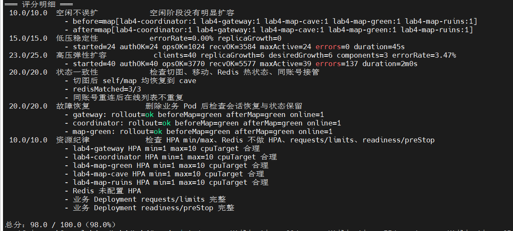

# Cloud Computing Labs and Distributed Game Systems


This repository contains a completed cloud computing course project centered on
networked multiplayer game systems. It starts from low-level TCP programming and
progressively extends toward distributed state management, fault recovery, and
Kubernetes-based cloud deployment.

## Highlights

- Built multiplayer game prototypes in Go and C++ using TCP client-server architecture.
- Designed application-level message protocols to handle TCP stream framing, sticky packets, heartbeat, timeout, and reconnection scenarios.
- Implemented concurrent server logic with goroutines, mutex-protected world state, and non-blocking connection handling.
- Explored authoritative server design, P2P lockstep synchronization, session recovery, and distributed state consistency.
- Deployed a distributed game backend on Kubernetes with gateway, coordinator, map services, Redis state storage, HPA autoscaling, health probes, RBAC, and graceful draining.
- Provided automated tests and score scripts for validating networking logic, distributed behavior, and cloud deployment quality.

## Selected Result

| Module | Result | Notes |
| --- | ---: | --- |
| `Lab/Lab4` | 98 / 100 | Kubernetes deployment score test, covering autoscaling, state consistency, fault recovery, and resource discipline |



## Repository Structure

```text
.
|-- CourseCode/        # Step-by-step runnable demonstrations
|   |-- ch3/           # TCP, framing, P2P lockstep, authoritative server, ReliableConn
|   |-- ch4/
|   |-- ch5/
|   `-- ch6/
|-- Lab/               # Hands-on cloud computing labs
|   |-- Lab1/          # TCP C/S game and JSON message protocol
|   |-- Lab2/          # Concurrent multiplayer world with goroutines and locks
|   |-- Lab3/          # Distributed world, multi-node coordination, persistence
|   `-- Lab4/          # Kubernetes deployment, HPA, Redis, probes, recovery
`-- warzone/           # Multiplayer battle game prototypes
    |-- c++/           # C++ implementation
    `-- go/            # Go implementation
```

## Technical Scope

| Area | Implementation |
| --- | --- |
| Networking | TCP sockets, JSON/binary protocols, message framing, heartbeat, timeout handling |
| Concurrency | Goroutines, connection workers, mutex/RWMutex protected state, concurrent broadcasts |
| Game server architecture | Authoritative server, P2P lockstep comparison, session recovery, client rendering |
| Distributed systems | Multi-map services, coordinator/gateway split, shared state, leader and lifecycle logic |
| Persistence | User accounts, game statistics, hot/cold data separation, Redis-backed state |
| Cloud deployment | Docker, Kubernetes Deployments, Services, StatefulSet, HPA, RBAC, probes, preStop draining |
| Verification | Automated lab tests, deployment tests, score tests, load-oriented validation |

## Featured Modules

### `CourseCode/ch3`

A sequence of runnable experiments for understanding networked game architecture:

- local game loop prototype
- TCP socket server/client communication
- sticky packet demonstrations and length-prefixed message framing
- P2P deterministic lockstep synchronization
- blocking server versus concurrent server design
- authoritative server state management
- `ReliableConn` wrapper with read deadlines, timeout-based receiving, and reconnection recovery

See [`CourseCode/ch3/README.md`](CourseCode/ch3/README.md).

### `warzone`

A terminal-based multiplayer battle game implemented in both Go and C++.

Key features include:

- login and registration flow
- TCP client-server communication
- multiplayer room state and ready/start flow
- real-time movement and attack actions
- heartbeat and disconnect handling
- persistent battle statistics
- terminal rendering optimization

See [`warzone/go/README.md`](warzone/go/README.md) and
[`warzone/c++/README.md`](warzone/c++/README.md).

### `Lab/Lab4`

A cloud-native deployment lab for a distributed game backend.

Main components:

- `gateway`: external TCP game entry
- `coordinator`: global session, routing, and cross-map logic
- `map-green`, `map-cave`, `map-ruins`: independent map services
- `redis`: shared state backend
- Kubernetes manifests for namespace/RBAC, Redis, services, deployments, HPA, probes, and lifecycle handling

The Lab4 deployment achieved **98/100** in the score test.

See [`Lab/Lab4/README.md`](Lab/Lab4/README.md).

## Quick Start

### Run the Go Warzone Prototype

```bash
cd warzone/go
go run ./cmd/server
go run ./cmd/client
```

### Build the C++ Warzone Prototype

```bash
cd warzone/c++
make
./server
./client
```

### Deploy Lab4 on Kubernetes

```bash
cd Lab/Lab4
kubectl apply -f deploy/
kubectl -n lab4 get pods,svc,hpa -o wide
```

Run validation:

```bash
./test/run-autotest.sh
./test/run-scoretest.sh
```

## What I Learned

Through this project, my understanding of cloud computing moved beyond
container deployment to the design, operation, and validation of a distributed
service. The earlier labs helped me work through practical networking issues,
including TCP connections, message framing, sticky packets, heartbeat,
timeouts, and reconnection. They also clarified how shared state, connection
management, and broadcast logic are handled in a concurrent game server.

The later labs extended the system into a distributed game backend with a
gateway, a coordinator, multiple map services, and Redis-backed shared state.
Deploying the system on Kubernetes helped me understand how service deployment,
health checks, autoscaling, RBAC configuration, graceful draining, and automated
tests fit together. It also made the relationship between state consistency,
fault recovery, resource limits, and validation more concrete.
